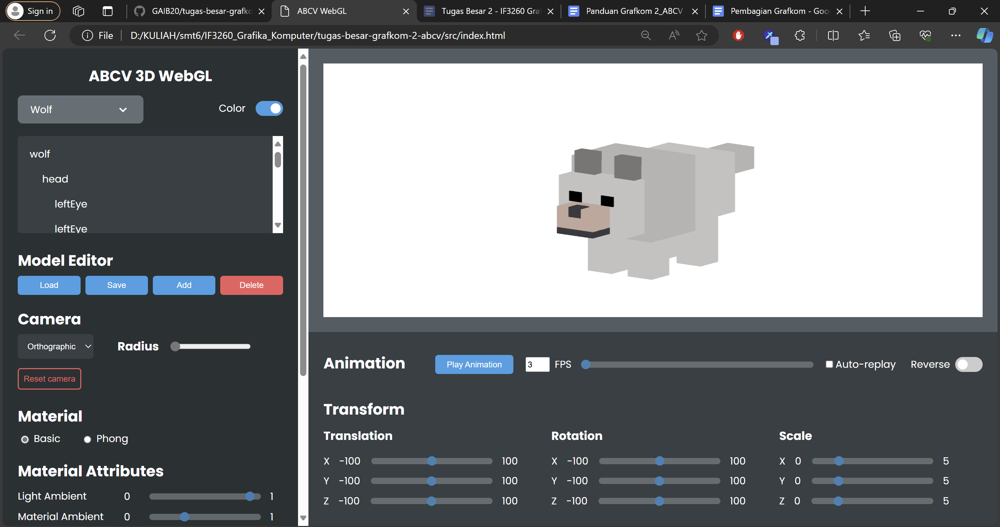
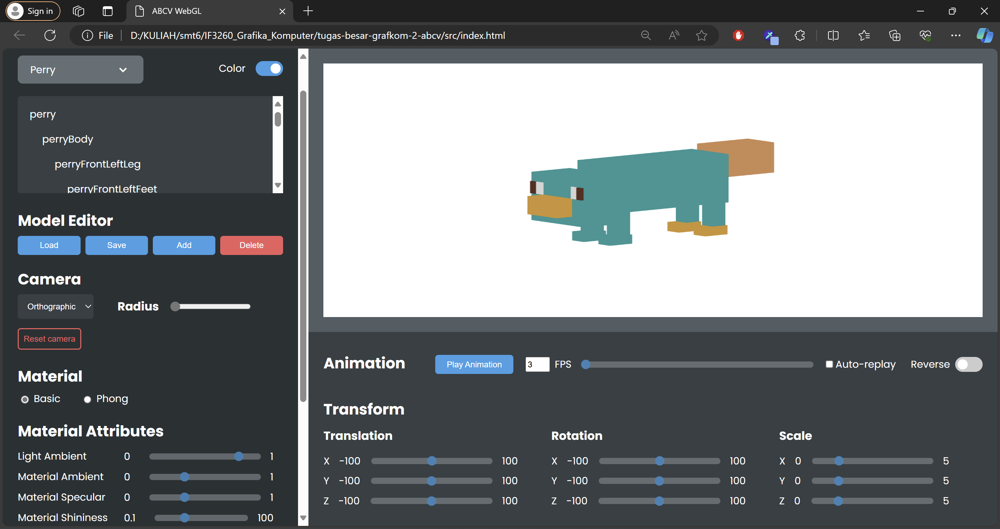

# WebGL 3D Engine
Tugas Besar II IF3260 Grafika Komputer

## Cara menjalankan program
1. Clone repositori dengan perintah ```git clone https://github.com/GAIB20/tugas-besar-grafkom-2-abcv.git```.
2. Pada folder ```src``` repositori, buka <i>file</i> ```index.html``` pada <i>browser</i> perangkat Anda.
3. Untuk panduan penggunaan <i>web</i>, silakan lihat dokumen panduan pada folder ```doc``` [berikut](docs/Panduan_ABCV.pdf).


## Fitur
### Fitur utama
1. Loading model <i>hollow</i> dan <i>articulated</i>.
2. Kamera
3. Material dan tekstur
4. Animasi model
5. Transformasi model (translasi, rotasi, dan skala)
6. <i>Scene graph</i>

### Fitur lanjutan
1. <i>Tweening</i> antar-<i>frame</i> animasi dengan ```easeOutSine```
2. <i>Component editor</i>: menambahkan komponen baru, menghapus komponen, mengekspor komponen, dan mengimpor komponen
3. <i>Vertex color</i> untuk mengaktifkan dan menonaktifkan warna pada objek
4. <i>Simple object controller</i> untuk mengontrol objek dengan keyboard

## Models and animation
### Hollow models
1. Pyramid
2. Octahedron
3. Cube
4. Tube

### Articulated models
1. Wolf
2. Duck
3. Goat
4. Perry

## Screenshots
<div style="display: flex; justify-content: center; flex-wrap: wrap;gap: 2rem;">
    
    
    
    
    
    
    
    
</div>


## Pembagian kerja
| NIM       | Nama                      | Pembagian Kerja   |
| --------- | -------                   | -----             |
| 13521059  | Arleen Chrysantha Gunardi | Model octahedron <br> Model wolf + animation <br> UI <br> Transformation <br> Animation controller <br> Tweening animation |
| 13521064  | Bill Clinton              | Model pyramid <br> Model duck + animation <br> Create model <br> Vertex Color <br> Simple object controller <br> Dokumen panduan |
| 13521078  | Christian Albert Hasiholan| Model cube <br> Model perry + animation <br> Kamera <br> Load model <br> Scene graph <br> Component editor |
| 13521099  | Vieri Fajar Firdaus       | Model tube <br> Model goat + animation <br> Material & texture <br> Dokumen panduan |
